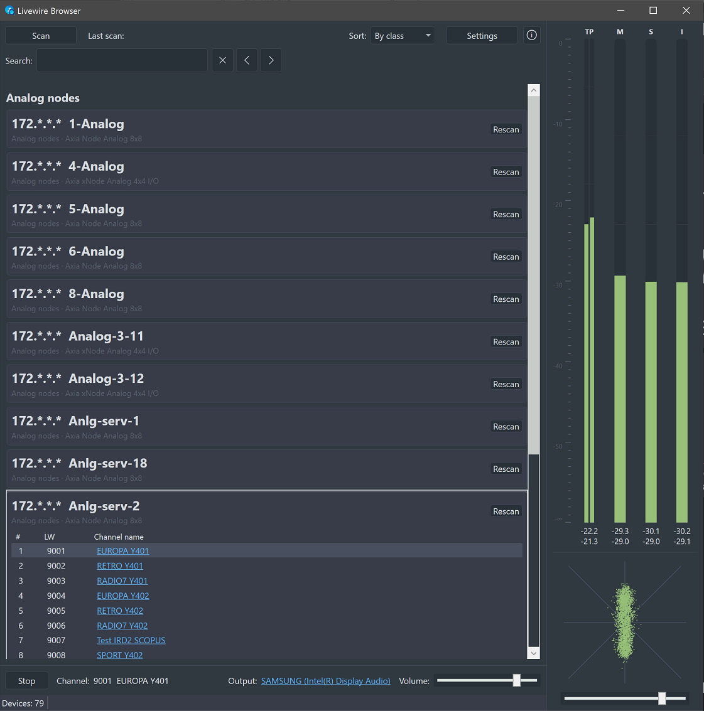
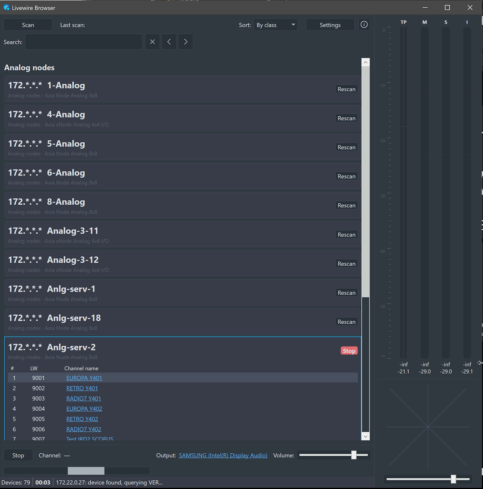
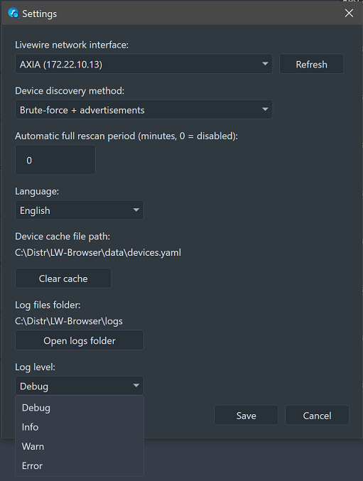

# Livewire Browser

> Русский | [English](README.md)

Windows GUI-приложение для обзора AoIP-сети Axia/Telos Livewire. Приложение находит аудиоустройства (ноды, Engine, Fusion, кодеки, телефонные гибриды), показывает их IP-адреса, модель и список Livewire-входов (Sources), позволяет прослушать выбраный канал на выбранном звуковом выходе с индикатором уровня True Peak, M/S/I LUFS и фазоскопом.



### Структура решения

```
src/
  LivewireBrowser.Core/      обнаружение устройств, модели, кэш, настройки, логирование
  LivewireBrowser.Audio/     приём RTP, декодирование PCM, воспроизведение через WASAPI
  LivewireBrowser.App/       WPF UI (MVVM)
tests/
  LivewireBrowser.Core.Tests/
```

### Стек

- .NET 8, WPF (MVVM, CommunityToolkit.Mvvm)
- NAudio — захват RTP, вывод через WASAPI
- YamlDotNet — кэш устройств и настройки

### Сборка и запуск

Для компиляции требуется [.NET 8 SDK x64](https://dotnet.microsoft.com/ru-ru/download/visual-studio-sdks).

```powershell
git clone https://github.com/ykmn/LivewireExplorer
cd .\LivewireExplorer
dotnet build LivewireBrowser.sln
dotnet run --project src\LivewireBrowser.App
dotnet test tests\LivewireBrowser.Core.Tests
```

### Публикация в `release/`

```powershell
powershell -ExecutionPolicy Bypass -File .\publish.ps1
```

Скрипт собирает self-contained single-file build (`win-x64`, без зависимости от установленного .NET) и кладёт `LivewireBrowser.exe` в папку [release/](release/) в корне проекта, предварительно очищая её.

## Как работает обнаружение устройств

Для реальной Livewire-сети нет открыто документированного UDP-протокола широковещательного обнаружения. Вместо этого приложение использует:

1. **LWRP (Livewire Routing Protocol) — TCP порт 93.** Это документированный построчный Telnet-подобный протокол управления, который держит каждое устройство Axia/Telos Livewire. Сканер ([LwrpScanner.cs](src/LivewireBrowser.Core/Discovery/LwrpScanner.cs)) перебирает все хосты подсети выбранного сетевого интерфейса, пытается подключиться на TCP/93, и если устройство ответило — посылает команды `VER` (информация об устройстве) и `SRC` (список исходящих каналов с именами и multicast-адресами).
2. **SAP/SDP-объявления (RFC 2974/4566), порт 9875** — дополнительный, более стандартный механизм для AES67/Livewire+ потоков. Работает только если на нодах явно включена опция "SAP Announcements" (Synchronization menu) — по умолчанию выключена на многих устройствах.
3. **Livewire Advertisement Protocol, UDP multicast 239.192.255.3:4001** — нативный протокол Axia Livewire, подтверждённый официальным мануалом Axia IP-Audio Driver (Rev 2.10): каждое LW-устройство и сам IP-Audio Driver периодически анонсируют свои каналы на эту multicast-группу (плюс порт 4000 для запроса немедленного полного анонса). В отличие от TCP/93-обхода подсети, это **пассивное прослушивание без перебора адресов** — заметно быстрее на больших сетях.

Результаты LWRP, SAP и Advertisement объединяются в [NetworkScanner.cs](src/LivewireBrowser.Core/Discovery/NetworkScanner.cs). Устройства, которые TCP/93-обход почему-то пропустил, но которые видны через Advertisement, тоже попадают в список.

### Формат Advertisement-пакета (реверс-инжиниринг по реальному перехвату)

Бинарный TLV-формат разобран по реальному packet capture (порт 4001), официально не задокументирован. Разбор реализован в [AdvertisementParser.cs](src/LivewireBrowser.Core/Discovery/AdvertisementParser.cs):

- Запись = `тег(4 ASCII-байта) + тип(1 байт) + значение`. Ширина значения зависит от типа: `0x00`→1 байт (счётчик вложенных полей: `NEST`, `INDI`), `0x01`→4 байта (`INIP`=IP устройства; `PSID`/`FSID`/`BSID`=ID источника — `FSID` это буквально multicast-адрес `239.192.x.y`/`239.193.x.y` как 4 сырых байта), `0x03`→строка (2-байтная длина + ASCII, дополнено нулями), `0x06`/`0x08`→2 байта, `0x07`→1 байт.
- Два вида пакетов: короткий периодический "маячок" (~87 байт, `ADVT=2`, без списка каналов) и полный анонс (`ADVT=1`, сотни-тысячи байт) с именем устройства (`ATRN`) и блоками источников, помеченными динамическими тегами `S001`, `S002`, ... — внутри каждого: `PSID` (номер LW-канала, младшие 2 байта), `FSID` (multicast-адрес), `PSNM` (имя канала — то же название поля, что и в LWRP `SRC`).
- Подтверждено на реальных данных: `PSID=0x5295` (21141) у канала с `FSID=EF C0 52 95` (239.192.82.149) — `82*256+149=21141`, совпадает с уже использующейся в приложении формулой декодирования LW-номера из multicast-адреса.

Подтверждённые на реальной сети поля ответа `VER`:
- `LWRP` (версия протокола),
- `DEVN` (имя/тип устройства
  - у простых нод служебное `lwwd`/`LiveAES`/`LiveIO`,
  - у Engine/Fusion/ZIP ONE/Sound4Streamer/Nx12 — буквально тип продукта),
- `NSRC`/`NDST`/`NGPI`/`NGPO` (число источников/приёмников/GPI/GPO),
- у xNode дополнительно `PRODUCT`+`MODEL` (например `"Axia xNode"` + `"Analog 4x4 I/O"`).
- Ответ `SRC` оформлен блоком `BEGIN ... SRC <num> PSNM:"..." RTPA:"a.b.c.d" ... END`, имя устройства/модель в приложении строятся из этих полей по приоритету: `PRODUCT+MODEL` → `DEVN` → `"LWRP device"`.

Официальная спецификация **Livewire Routing Protocol v2.0.2** (Telos Systems Corp.) подтверждает, что команда `IP` (без параметров) возвращает текущую сетевую конфигурацию устройства, включая `hostname:<имя>` (DNS-совместимое, максимум 12 символов) — это имя, заданное на самом устройстве, а не угадываемое снаружи. Приоритет имени устройства в приложении:
1) `hostname` из ответа на `IP` →
2) для категории "IP-драйверы" — реальное имя компьютера через **NetBIOS Name Service** (см. ниже) →
3) обратный DNS (PTR-запрос) →
4) `PRODUCT+MODEL`/`DEVN` из `VER`.

### Имя компьютера для IP-Audio Driver

Драйвер Axia IP-Audio Driver — это ПО на Windows-машине, а не отдельное железное устройство, и часто не имеет PTR-записи в DNS сети. Для категории "IP-драйверы" приложение дополнительно опрашивает хост через **NetBIOS Name Service** (UDP/137, "Node Status" запрос — тот же механизм, что у `nbtstat -A <ip>`) и получает настоящее имя компьютера Windows напрямую с машины, независимо от настроек DNS ([NetBiosNameResolver.cs](src/LivewireBrowser.Core/Network/NetBiosNameResolver.cs)).

Подтверждено на реальном устройстве: ответ на `IP`-запрос приходит **двумя отдельными строками** и в **разных форматах** — `IP ADDR:"172.22.0.36" LINK:1` (двоеточие, как в `VER`/`SRC`) и отдельно `IP hostname air-pc2` (без двоеточия вообще, просто слово-значение через пробел). `ExtractIpHostname` разбирает оба варианта.

**IP-Audio Driver (программный драйвер на ПК).** `DEVN:"lwwd"` не описан в официальной спецификации, но на реальных сетях стабильно встречается с числом источников/приёмников/GPI/GPO, точно совпадающим с заявленными характеристиками продукта Axia IP-Audio Driver (1/4/8/24-канальные версии) — это эвристика по косвенным признакам, не гарантия протокола. Такие устройства попадают в отдельную категорию "IP-драйверы" с моделью "Axia IP-Audio Driver"; имя компьютера, на котором драйвер установлен, в типичном случае получается через тот же `hostname` из `IP`-запроса (драйвер обычно сообщает имя ПК как сетевое имя устройства) или через обратный DNS.

> [!IMPORTANT]
> **Оговорка.** Точная семантика остальных, ещё не встретившихся атрибутов LWRP не задокументирована официально Telos Alliance — то, что выше, проверено по логам реальной сети и по найденной официальной спецификации, но не исключены отличия у других поколений или прошивок. Если что-то определяется неверно — смотрите лог-файл (на уровне Debug там пишутся сырые строки ответа `VER`/`SRC`/`IP`) и правьте настройки парсинга в [LwrpScanner.cs](src/LivewireBrowser.Core/Discovery/LwrpScanner.cs).

Если ни `hostname` из `IP`, ни обратный DNS не разрешились (например, на сети без настроенных hostname для каждого устройства), приложение подставляет IP-адрес в скобках после общего самоописания устройства (например `LiveIO (172.22.0.27)`) — иначе несколько однотипных нод выглядели бы в списке одинаково и неразличимо.

В UI устройство показывает раздельно **"Класс устройства"** (категория из списка ниже - ноды, кодеки, Engine и т.д.), **"Название"** (приоритет: настроенный hostname → обратный DNS → IP-суффикс) и **"Модель устройства"** (например, для цифровой ноды — `AES/EBU 8x8 I/O`, для телефонного гибрида — `Nx12`).

> [!NOTE]
> Livewire-драйвер для Linux пока не рассматривается.

> [!TIP]
> Кнопкой `/` можно скрыть последние цифры в списке IP-адресов.
> В режиме сортировки по классам устройств кнопкой `+` можно развернуть все категории и найденные устройства, а кнопкой `-` свернуть.

## Остановка скана и пересканирования



Кнопка "Скан" во время выполнения полного скана меняется на "Остановить", и точно так же кнопка "Пересканировать" у конкретного устройства — повторное нажатие отменяет соответствующую операцию (`CancellationToken`, передаётся через всю цепочку `NetworkScanner.FullScanAsync`/`RescanDeviceAsync` → `LwrpScanner` → `SapListener`).

Статус-бар в течение всего скана показывает, что именно сейчас происходит (текущий опрашиваемый IP и стадия запроса — TCP/93, VER, SRC, IP), а также сообщения о старте/остановке/завершении скана.

> [!WARNING]
> - LWRP-сканирование подсети ограничено 4096 хостами (см. `NetworkInterfaceHelper.GetHostAddresses`) — для очень крупных подсетей (например /16) будет просканирована только часть адресов; рекомендуется использовать интерфейс с подсетью /24 или `уже.
> - Поля LWRP-протокола восстановлены неофициально путём разбора ответов устройств (см. оговорку выше) — корректность парсинга имён/моделей/каналов будет зависеть от конкретной прошивки.

## Прослушивание канала

При клике на номер канала приложение подключается к multicast-группе канала и принимает RTP напрямую (`RtpReceiver` в [LivewireBrowser.Audio](src/LivewireBrowser.Audio)), декодирует линейный PCM (24 бит, big-endian, 48 кГц — подтверждено по реальному захвату пакетов) и выводит через WASAPI (`AudioPlaybackEngine`) на выбранное в нижней панели звуковое устройство, с индикатором уровня (`LevelMeter`) и слайдером громкости.

`RtpReceiver` разбирает RTP-заголовок по RFC 3550 не как фиксированные 12 байт, а с учётом переменной длины: список CSRC-идентификаторов и опциональный extension-заголовок могут сдвигать начало полезной нагрузки, а бит padding — добавлять паддинг-байты в конце пакета (`RtpReceiver.TryGetPayloadRange`). Без этого хвост заголовка/паддинг попадал в декодер как аудиосэмплы и был слышен как белый шум.

### Номер LW-канала

Livewire кодирует свой 16-битный номер канала в multicast-адресе: `239.192.<hi>.<lo>` ⇔ канал `hi*256+lo`. Приложение вычисляет его автоматически (`LwrpScanner.ComputeLwNumber`) и показывает рядом с порядковым номером источника на устройстве (`ChannelNumber`) и именем канала.

### Измерители громкости

Справа в главном окне — четыре вертикальных индикатора: **True Peak**, **Momentary**, **Short Term** и **Integrated Loudness**, каждый с текущим значением и кликабельным максимумом (клик сбрасывает только этот максимум). Реализованы в [LoudnessMeter.cs](src/LivewireBrowser.Audio/LoudnessMeter.cs):
- K-weighting (ITU-R BS.1770-4, предусилительный + RLB-фильтр) по гейтинг-блокам 100 мс,
- Momentary/Short Term — скользящее среднее за 400 мс/3000 мс,
- Integrated — честный двухпроходный гейтинг по EBU R128 (абсолютный гейт -70 LUFS, относительный — "среднее минус 10 LU")
- True Peak — приближение через 4-кратную линейно интерполированную передискретизацию, а не полная полифазная реконструкция по Приложению 2 ITU-R BS.1770 — не сертифицированное измерение, но ловит большинство межсэмпловых пиков, которые обычный peak-метр по сэмплам пропускает.

Для фазоскопа предусмотрена ручка усиления входного уровня x1...x12 в целях улучшения картинки.

## Кэш, настройки и логи

Все рабочие файлы приложения лежат рядом с `.exe`, а не в `%LOCALAPPDATA%` или Program Files — это позволяет приложению работать как портативное и не зависеть от прав на запись в системные папки. Вы можете редактировать эти файлы вручную, соблюдая синтаксис YAML, или удалить - они создадутся заново:

- `data/devices.yaml` — кэш последнего найденного списка устройств и каналов (загружается при старте, обновляется после каждого скана). Сохраняются все поля: класс, модель и название устройства, IP, для каждого канала — порядковый номер, номер LW, имя, multicast-адрес/порт, признак активности (`IsActive`).
- `data/settings.yaml` — настройки: выбранный сетевой интерфейс Livewire, период автоматического полного пересканирования, последняя громкость, размер главного окна (сохраняется при закрытии, восстанавливается при следующем запуске).
- `logs/app-YYYYMMDD.log` — отладочный лог (новый файл на каждый день). Пишутся: отправленные/полученные пакеты, результаты разбора, ошибки сети и аудио, необработанные исключения UI. Открыть папку можно прямо из приложения: **Настройки → "Открыть папку логов"**. Глубина логирования настраивается (`AppSettings.LogLevel`, по умолчанию `Warn` для новых профилей) — переключить на `Debug` стоит перед диагностикой проблемы, иначе подробности (например, разбор пакетов) в лог не попадут.

## Настройки приложения

Открываются кнопкой **"Настройки"** в главном окне:



- **Сетевой интерфейс Livewire** — обязательно выбрать перед сканированием; без этого трафик уходит через интерфейс по умолчанию и обычно не достигает Livewire-сети на многосетевых машинах. Список и кнопка "Обновить" берут данные из `NetworkInterfaceHelper`.
- **Способ поиска устройств** (`DiscoveryMode`): "Поиск перебором" — только TCP/93-обход всех хостов подсети (`LwrpScanner.ScanSubnetAsync`); "Поиск перебором и по анонсам" — то же плюс пассивное прослушивание SAP/Advertisement multicast (по умолчанию, прежнее поведение); "Поиск по анонсам" — только пассивное прослушивание, без обхода подсети (быстрее, но не увидит устройства, которые не анонсируют себя).
- **Период автоматического полного пересканирования** (в минутах, 0 — выключено).
- **Язык** (`English`/`Russian`, по умолчанию `English`) — переключается без перезапуска приложения.
- **Глубина логирования** (`Debug`/`Info`/`Warn`/`Error`, по умолчанию `Warn`).
- **Сброс кэша устройств.**
- **Открыть папку логов.**

Размер и позиция главного окна сохраняются отдельно от диалога настроек — автоматически при закрытии приложения, восстанавливаются при следующем запуске с проверкой, что сохранённая позиция всё ещё попадает на видимый экран.

## Локализация

Интерфейс полностью на английском или русском (см. настройку "Язык" выше). Все строки — в [Strings.en.xaml](src/LivewireBrowser.App/Localization/Strings.en.xaml) / [Strings.ru.xaml](src/LivewireBrowser.App/Localization/Strings.ru.xaml); статические XAML-метки читают их через `{DynamicResource}` (обновляются на лету при смене языка), код вьюмоделей — через `Loc.Get(key)`. Переключение происходит мгновенно, без перезапуска окон.

## Сортировка и поиск

- **Сортировка** (выпадающий список рядом с кнопкой "Скан"): по классу устройства (группы + по названию внутри группы), по IP-адресу (числовое сравнение октетов через [IpAddressUtil.cs](src/LivewireBrowser.Core/Network/IpAddressUtil.cs), а не строковое — `172.22.0.9` идёт раньше `172.22.0.10`), по названию. **По умолчанию — по IP-адресу.** Применяется сразу и пересчитывается после каждого скана/пересканирования.

  При сортировке по классу устройства найденные устройства группируются по категориям ([DeviceClassifier.cs](src/LivewireBrowser.Core/Discovery/DeviceClassifier.cs)): аналоговые ноды, цифровые ноды, Engine, Fusion, кодеки, телефонные гибриды, IP-драйверы, прочее. Классификация — по подстрокам в ответе `VER` (модель/тип устройства); список соответствий легко расширяется.

- **Поиск** (поле "Поиск:" под панелью сортировки) — живой поиск по подстроке среди класса, названия, модели и IP-адреса любого устройства (`DeviceViewModel.MatchesSearch`). Кнопки ◀/▶ переходят между найденными совпадениями по кругу, текущее совпадение подсвечивается жёлтым и автоматически прокручивается в видимую область списка.

## Лицензия

Приложение распространяется под лицензией GPL v3. Я, как автор, открываю исходный код и разрешаю:

- использовать приложение в личных, образовательных и коммерческих целях;
- модифицировать приложение.

Ограничения лицензии:

- при распространении оригинального приложения обязательна ссылка на этот репозиторий;
- при модификации обязательно публиковать исходный код, нельзя делать проект закрытым;
- любые производные работы также становятся GPL v3.

## Donate
RU: [https://yoomoney.ru/to/4100135835863](https://yoomoney.ru/to/4100135835863)
International: `0x0EDe142a3D9f1D556562e112A9bC34c220158C9A` *(ETH, BNB, Poly, Arbitrum, Base)*
